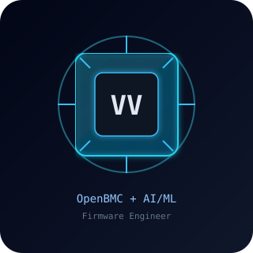
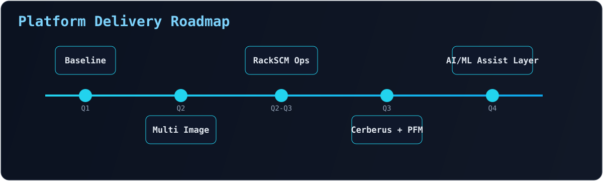
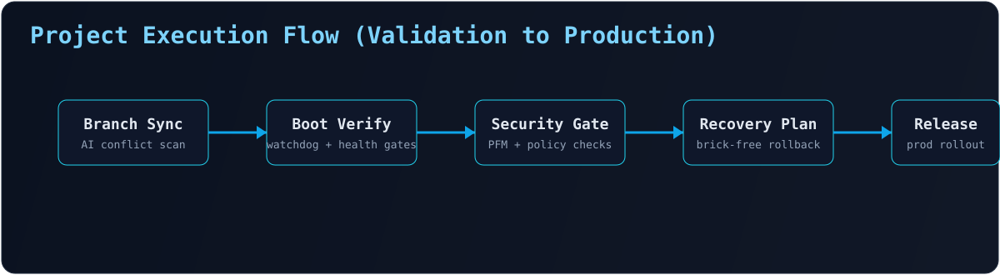
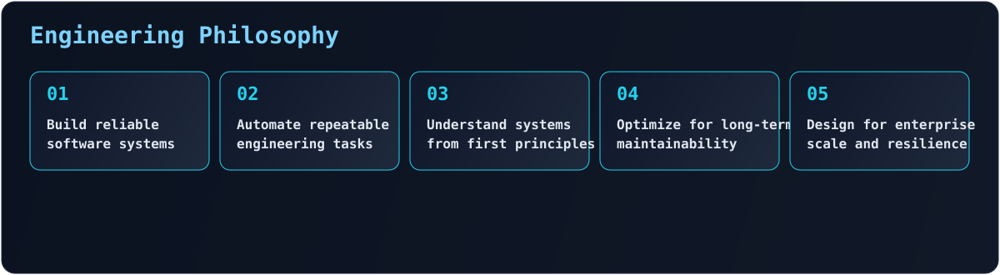

  

  

<table align="center">
  <tr>
    <td width="180" align="center" valign="top">
      
       
      OpenBMC Firmware Developer
    </td>
    <td valign="top">
      <h3>Vijay Vinayak</h3>
      <strong>Senior System Software Engineer</strong>  
      OpenBMC Firmware Engineer • AI/ML Systems Engineer • Modern C++ • Yocto 
      Firmware Engineering • Platform Management • Linux Systems Programming
        
      
      
      
      
      
    </td>
  </tr>
</table>

  

## Professional Summary

Senior System Software Engineer with 5+ years building production-grade platform software for enterprise server management and OpenBMC ecosystems.

- Core domains: OpenBMC, Embedded Linux, Linux internals, system programming, Modern C++, Yocto Project
- Platform interfaces: D-Bus, Redfish, IPMI
- Security focus: secure firmware validation, trust chain enforcement, and resilient update pipelines
- Hardware and platform depth: AST2500, AST2600, Microsoft OpenBMC platforms
- Delivery signature: maintainable architecture, operational reliability, high-uptime firmware services

  

  

## Technology Dashboard

<table>
  <tr>
    <td width="18%"><strong>Languages</strong></td>
    <td><code>C</code> <code>C++</code> <code>Python</code> <code>Bash</code></td>
  </tr>
  <tr>
    <td><strong>Firmware</strong></td>
    <td><code>OpenBMC</code> <code>U-Boot</code> <code>IPMI</code> <code>Redfish</code> <code>D-Bus</code></td>
  </tr>
  <tr>
    <td><strong>Embedded Linux</strong></td>
    <td><code>Linux Internals</code> <code>System Programming</code> <code>IPC</code> <code>Multi-threading</code> <code>Socket Programming</code> <code>Device Drivers</code></td>
  </tr>
  <tr>
    <td><strong>Yocto</strong></td>
    <td><code>BitBake</code> <code>Recipes</code> <code>Layers</code> <code>BSP</code> <code>Cross Compilation</code></td>
  </tr>
  <tr>
    <td><strong>Security</strong></td>
    <td><code>Cerberus</code> <code>PFM</code> <code>Secure Boot</code> <code>OpenSSL</code></td>
  </tr>
  <tr>
    <td><strong>Tools</strong></td>
    <td><code>Git</code> <code>GDB</code> <code>CMake</code> <code>Meson</code> <code>QEMU</code> <code>Wireshark</code></td>
  </tr>
</table>

  

  

## Engineering Expertise Matrix

  

  

  

  

## Impact Metrics

  

<table>
  <tr>
    <td width="33%" valign="top">
      <h3>OpenBMC</h3>
      <ul>
        <li>Firmware Update Framework</li>
        <li>Multi Image Update</li>
        <li>RackSCM Management</li>
        <li>IPMI Stack Development</li>
        <li>Redfish Integration</li>
      </ul>
    </td>
    <td width="33%" valign="top">
      <h3>Security</h3>
      <ul>
        <li>Cerberus-Core</li>
        <li>Platform Firmware Manifest</li>
        <li>Secure Firmware Validation</li>
      </ul>
    </td>
    <td width="33%" valign="top">
      <h3>Linux</h3>
      <ul>
        <li>Multi-threaded Applications</li>
        <li>IPC Frameworks</li>
        <li>Device Driver Integration</li>
      </ul>
    </td>
  </tr>
</table>

  

  

## Featured Projects

  

<table>
  <tr>
    <td width="50%" valign="top">
      <h3>AI-Powered Git Branch Sync and Cherry Pick Automation</h3>
      <ul>
        <li>AI conflict analysis for rapid branch convergence</li>
        <li>Integrated workflows with GitHub Copilot, Claude, and Gemini</li>
        <li>Cross-platform delivery across GitLab and Azure DevOps</li>
        <li>Reduced manual merge overhead in large code streams</li>
      </ul>
    </td>
    <td width="50%" valign="top">
      <h3>Multi-Stage BMC Boot Validation and Recovery Framework</h3>
      <ul>
        <li>Secure Boot flow validation across boot stages</li>
        <li>Watchdog-driven health validation and fault detection</li>
        <li>Automated firmware recovery for brick-free updates</li>
        <li>Production-focused resilience for enterprise servers</li>
      </ul>
    </td>
  </tr>
</table>

  

  

## GitHub Analytics Command Center

  
  

  
  

  

  

  
  
  

  

## Open Source

  

### Engineering Philosophy

  

### Current Focus

  

  
  
  
  
  

### Achievements

- Microsoft OpenBMC Development
- AMI Spot Awards
- Firmware Security Integrations
- Large Scale Code Synchronization
- Enterprise Server Platform Development

  

## Connect

  
  
  

  

  

